### Hospital Management System – Needs W.r.t Application Stability

* The architecture of management System is as follows

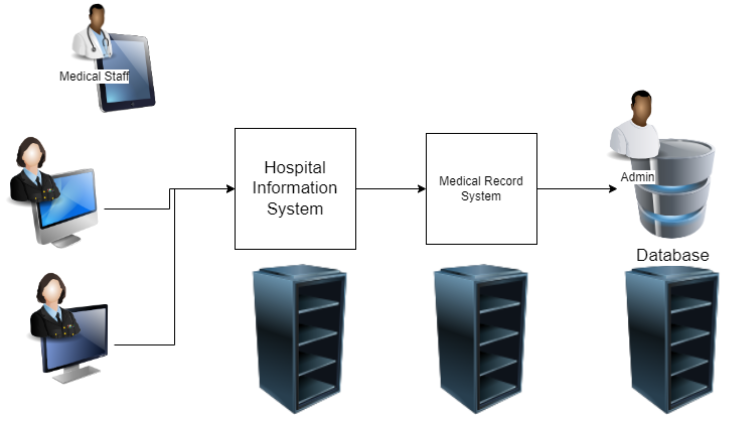

* Your organization `qtinfosystems` is maintaing this system for 100 hospitals
* Now let's try to figure out some failures
    * Network failures
    * Hardware failures
    * Application failures
* You are assigned to figure out failures. To solve this issues we will figure out a pro-active approach
    * For every 1 minute
        * check if every server is responding or not
        * Check if  application is responding or not
    * Alert if the servers/applications are not responding
* Log is a record which specifies some activity done
    * Operating systems have logs, we might need to finetune it
        * Windows => event viewer
        * Linux => Syslog
    * Applications also log, try to understand about failure from there
* Tracing is an approach to figure out the flow in your system
* Every system has resource utilization information
    * cpu
    * memory
    * disk
    * network
* Metrics are values which represent some information about system/application with value as number with time dimension
* QT Info System needs a Monitoring Solution.
* Observability is what QT Info System needs i.e. they need to get
    * logs
    * metrics
    * traces
* MTTR (Mean Time To Recover) this refers to average time taken by your organization to recover from failures
* MTTF (Mean Time To Fail): This refers to average time during the certain to get an failure in your system
* SLA (Service Level Agreement): This is an agreement between service provider and customer w.r.t to availability and other important metrics

### What has to be monitored?

* There are organizations and individuals who have published the best practices on implementing a monitoring solution
    * Google Four Golden signals 
    
    [ Refer Here : https://sre.google/sre-book/monitoring-distributed-systems/ ]

    * USE method 
    
    [ Refer Here : https://www.brendangregg.com/usemethod.html ]

    * RED method 
    
    [ Refer Here :  ]

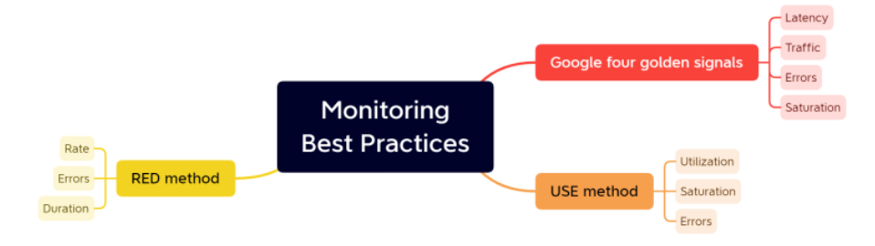

### Terms in Monitoring


* Latency
* Traffic
* Errors
* Saturation

### Some basic Stuff


* Impact of  CPU, Memory and DISK on your applicaions

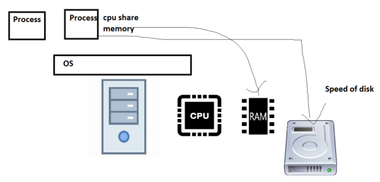

* _**Webserver**_ : When requests are sent, threads are created which will have its own  cpu and memory share. So as number of requests increase the load on cpu and memory increases.

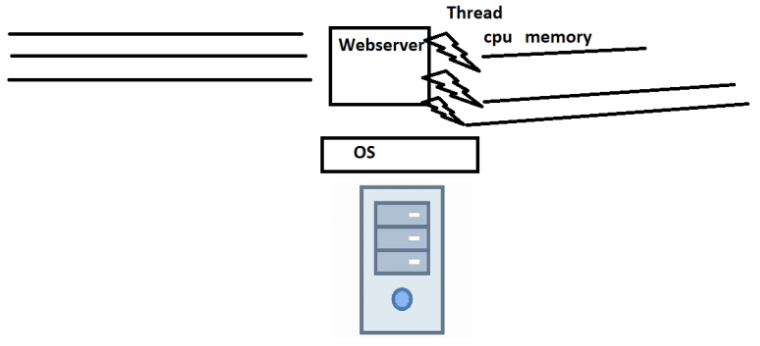

* Generally, to figure out the saturation points, organizations stress/load the systems with the help of performance test engineers

### Metrics

* for detailed info on logs vs metrics vs traces

    [ Refer Here : https://microsoft.github.io/code-with-engineering-playbook/observability/log-vs-metric-vs-trace/ ]

* _**Metrics**_ : Metrics are numeric time-series data.

### Logs

* Logs are text informations with no standard way/format.
* Logs from different applications/servers
    * Apache `192.168.2.20 - - [28/Jul/2006:10:27:10 -0300] "GET /cgi-bin/try/ HTTP/1.0" 200 3395`
    * For some other  applications

    [ Refer Here : https://www.ossec.net/docs/log_samples/ ]
    
* For logs we deal with text (unstructured data)
* Using logs requires a solution to
    * convert unstructured text in semi structured
    * understand logs with various format
    * Log analysis solution

### Traces

* APM ( Application Performance Monitoring) Agents can help
* We are trying to make our applications observable
* Monitoring tells you when something is wrong, while observability enables you to understand why.
* Tools


### Pull vs Push Monitoring

* _**Pull Monitoring**_ : Monitoring System pulls the information from various servers/applications/network devices the metrics.

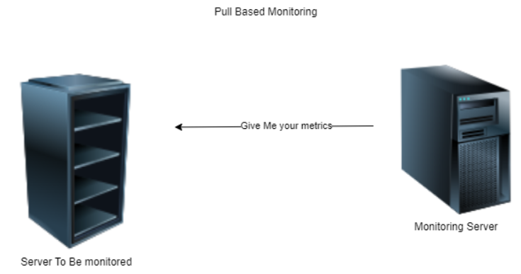

* _**Push Monitoring**_ : Monitoring system get the information from various servers/applications

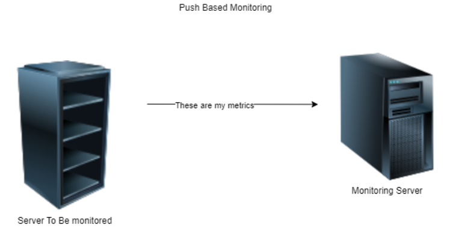

* Examples
 1. Pull:
        * Prometheus
        * Nagios
 2. Push:
        * Log stash
        * splunk

### Elastic Stack

* This was called as ELK Stack
* ELK
    * E = Elastic Search
    * L = Log Stash
    * K = Kibana
* Architecture

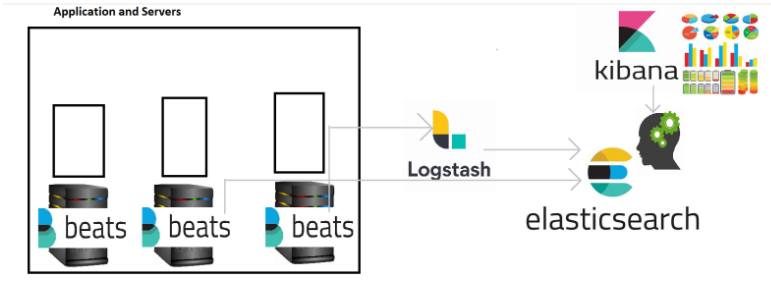

* _**Elastic Search**_ : This is memory or storage system in the Elastic Stack
* _**Logstash**_ : Responsible for making logs queryable
* _**Beats**_ : Export metrics, logs, traces to Elastic Search
* _**Kibana**_ : Creates dashboards and visualizations

### Google for the following

* What are popular metrics for
    * web server (apache)
    * database (mysql)
* Web Servers
    * Requests per second
    * Errors
    * Thread count
    * Response Time (Average)
* Server:
    * CPU Uilization
    * Free Memory/Used Memory
    * Disk Space
    * Disk I/O
    * Network
        * Incoming
        * Outgoing
* Databases:
    * Number of Connetions
    * Size of Data Processed per second
    * Database Size

### Applications we will be observing


* _**Traditional Applications**_ : These are the applications which run on physical or virtual machines hosted on-premises or cloud
* _**Containerized Applications**_ : These will be the applications running on kubernetes cluster.
* Technology:
    * Python
    * .net
    * C#
    * nodejs
* Approach:
    * We will be getting info in the following order
        * metrics
        * logs
        * traces
    * What is Site Reliability Engineering?

### Traditional Applications

* I will be sharing some scripts when necessary
* Let's choose the same applications for both traditional and k8s

### Lab Setup

* Cloud Account (AWS/Azure)
* Elastic Cloud (14 day free trail)
* How to create VMs?

### Options

* Ecommerce
    * shopizer (java)
    * nopCommerce (.net)
    * Saleor (python)
    * Sprut Commerce (nodejs)
* Medical Record System/Hospital managment system
    * Open Mrs (java)
    * Bahmni (java)
    * hospital run (node js)

### NOP Commerce

* To install this application we need atleast two servers
    * database server: (Linux/Windows)
        * mysql
        * microsoft sql server
        * postgres
    * application/web server: (Linux/Windows)
    * dotnet core
    * nginx
* Our setup:
    * 2 ubuntu Linux servers
* Metrics:
    * Server Metrics
        * cpu
        * memory
        * disk
        * network
    * Application metrics
        * Requests
        * Errors
        * Response time
* Installation
    * Manual
    * Automated 

### nopCommerce Architecture

* This  application has two  servers involved

* Application:
    * This application runs on .net core 7
    * install the application
    * If the application is horizontally scaled, then we will be using a loadbalancer/reverse  proxy
* Database
    * we will be using mysql database
    * This can be a managed database

    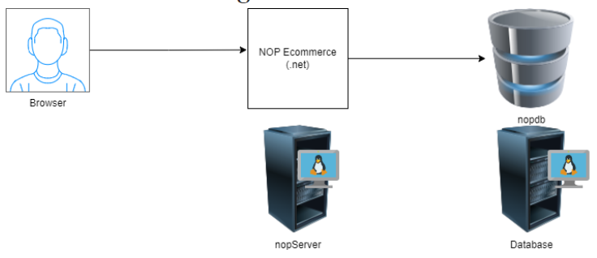

### Realizing this application in AWS

* Let me create a free tier rds based mysql
* Install dotnet 7 on ubuntu vm 

    [ Refer Here : https://learn.microsoft.com/en-us/dotnet/core/install/linux-scripted-manual#scripted-install ]

* For installing nopcommerce on linux

    [ Refer Here : https://docs.nopcommerce.com/en/installation-and-upgrading/installing-nopcommerce/installing-on-linux.html ]

* Refer To classroom video for installation

### Next Steps

* Let's create a basic check to verify if
    * the server is alive
    * the application is alive
* _**Email Alerts**_ : Create an inbox in mail trap

    [ Refer Here : https://mailtrap.io/ ]

### Monitoring and Observability Setup

#### Labsetup

* We will be using two elastic cloud accounts
    * one account for dev/experimentation
    * other account for making nopCommerce observable
* We need a mail trap setup for alerts where we will have two inboxes

### Working with Elastic Stack

* Understanding of YAML

    [ Refer here : https://www.youtube.com/watch?v=ggOmHlnhPaM&list=PLuVH8Jaq3mLud3sVDvJ-gJ__0zd15wGDd&index=16 ]

### Elastic Cloud Account Setup

* Create a free trail account 

    [ Refer Here : https://www.elastic.co/cloud/ ]

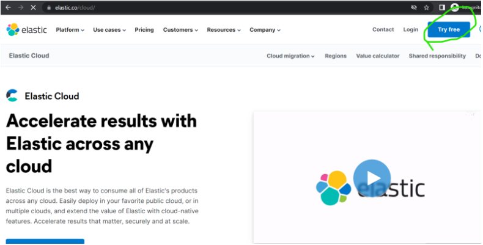
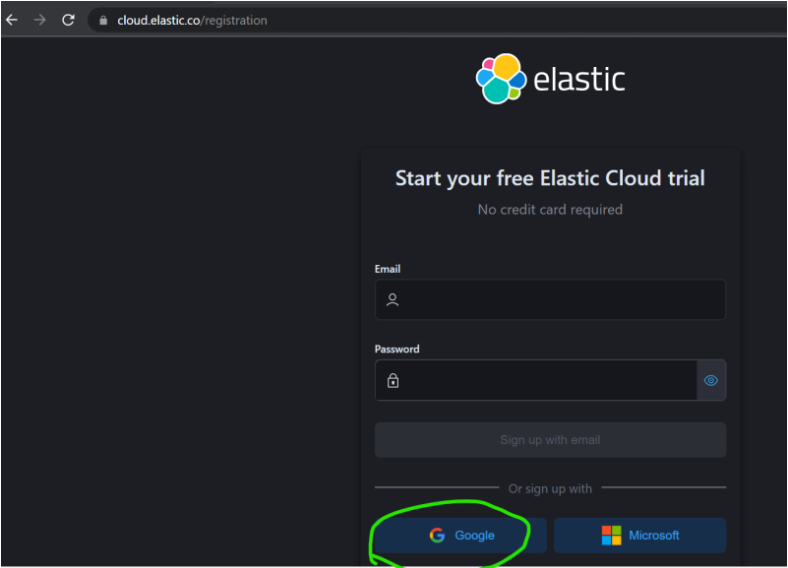
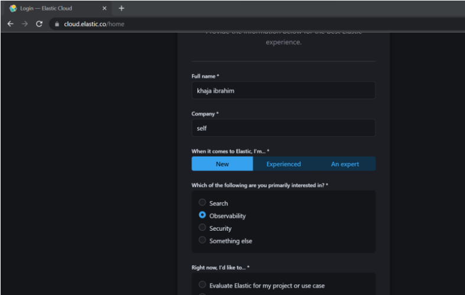
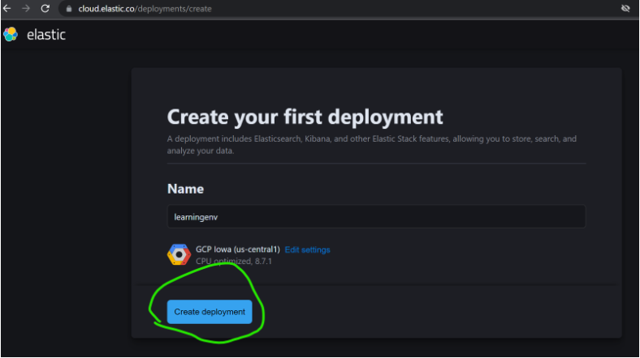
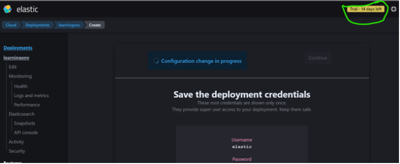
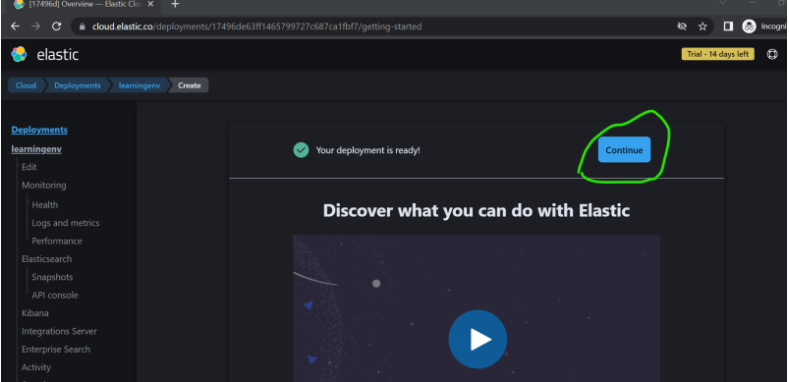
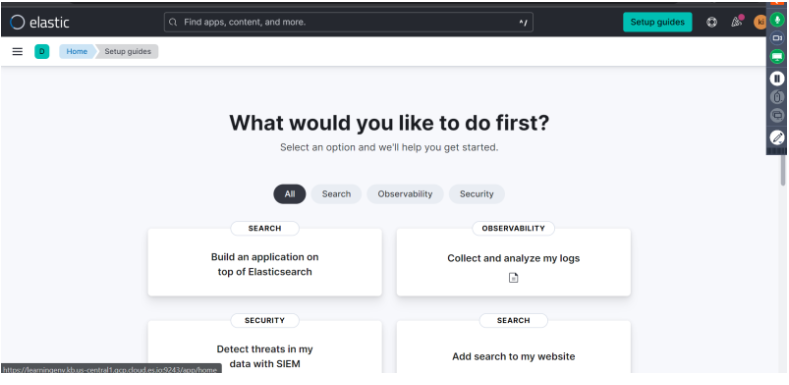

* Let's setup connectors for communications (email/teams/slack)

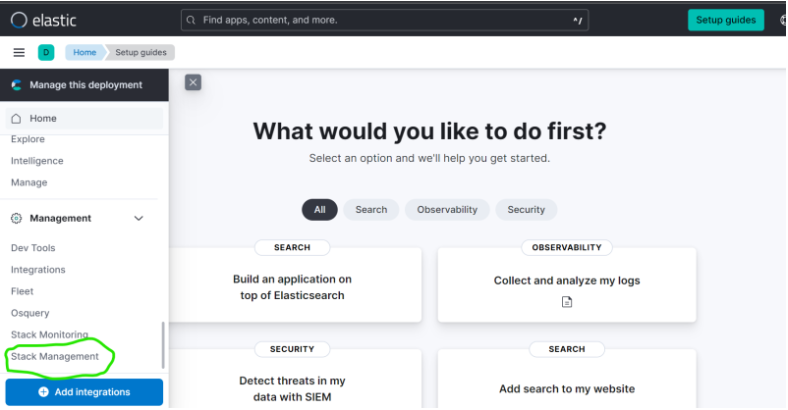
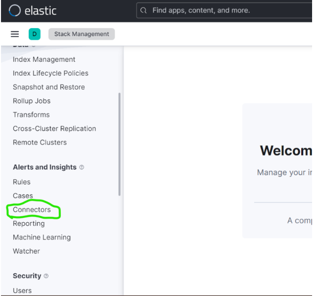
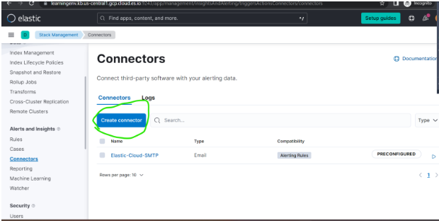
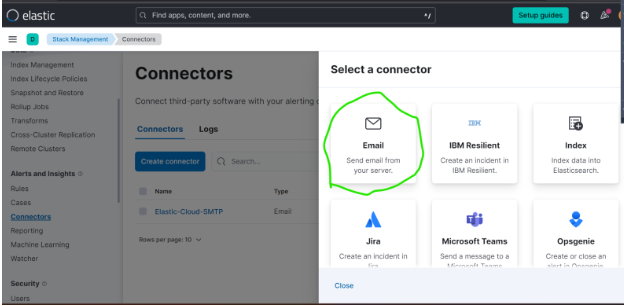

* For email create account in mailtrap and use the credentials of mail trap over here
* Enter the details of mail trap in email and run the test 

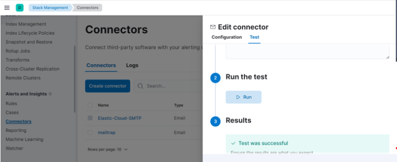
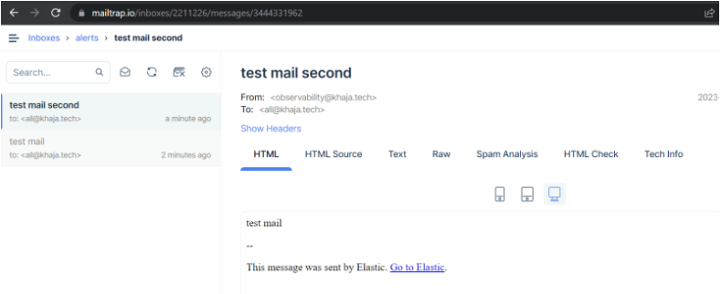

### Workflow

* Overview

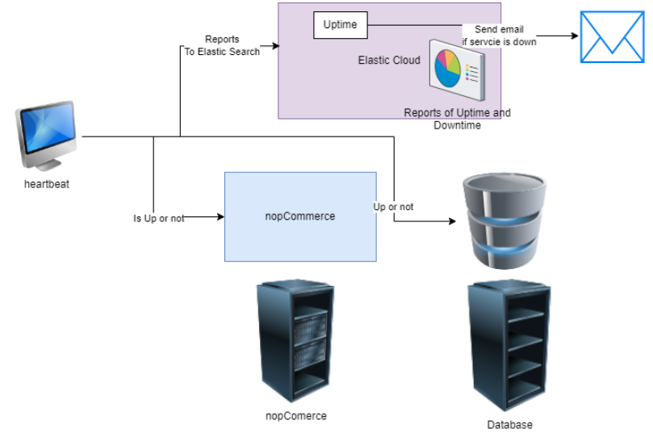

* We will have a system with heartbeat installed which checks if the application/server is up or not and reports the status to elastic cloud (elastic search)
* The uptime in observability section of elastic cloud will show the status of each service/server from which you can configure alerts based on connectors

### Uptime Monitoring

* For the overview of the setup

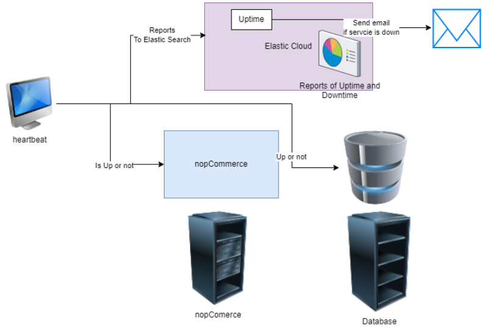

* Let's create a linux machine and
    * install heart beat
    * configure heart beat to send metrics to elastic  cloud
* We will be configuring heart beat to check if the
    * apache  server is alive
    ```
    bash
    sudo apt update
    sudo apt install apache2 -y
    ```
* _**Heart beat installation**_ :
    
* For the overview [  Refer Here : https://www.elastic.co/guide/en/beats/heartbeat/current/heartbeat-installation-configuration.html ]

* For official doc's on installing heart beat

    [ Refer here : https://www.elastic.co/guide/en/beats/heartbeat/current/heartbeat-installation-configuration.html#installation ] 
    
* For apt based installation

    [ Refer Here : https://www.elastic.co/guide/en/beats/heartbeat/current/setup-repositories.html#_apt ]

* _**Configuration**_ :

* All the elastic stack is generally installed and configuration files are stored in similar directories

* _**config location**_ : `/etc/<prod-name>`

* _**install location**_ : `/usr/share/<prod-name>`

* Edit `/etc/heartbeat/heartbeat.yml` to add cloud id and auth
* What has to be monitored
    * apache server
    * Monitor types: 
    
    [ Refer Here : https://www.elastic.co/guide/en/beats/heartbeat/current/configuration-heartbeat-options.html#monitor-types ]

* Configuration 

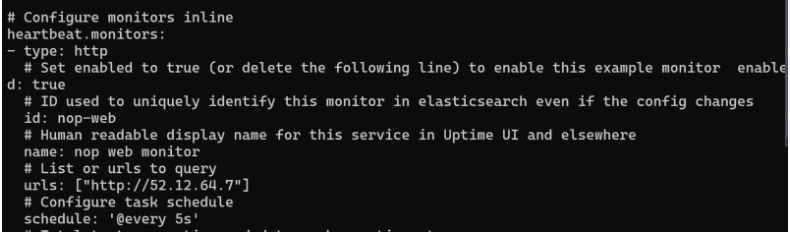

* Start heart beat: 

    [ Refer Here : https://www.elastic.co/guide/en/beats/heartbeat/current/heartbeat-installation-configuration.html#start ]

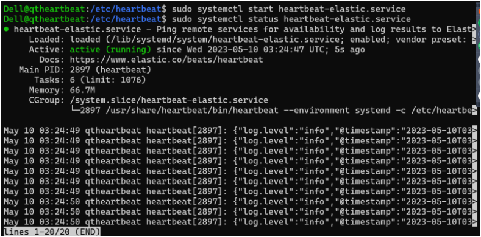

* Now open kibana & navigate to uptime

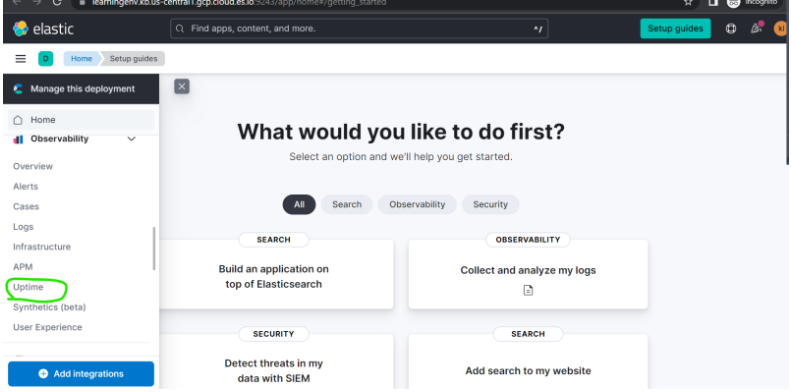
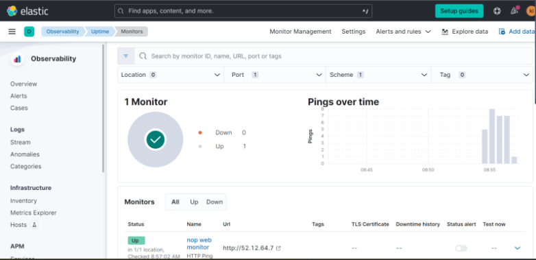

* To view th down status. stop the service and wait for the page to reload

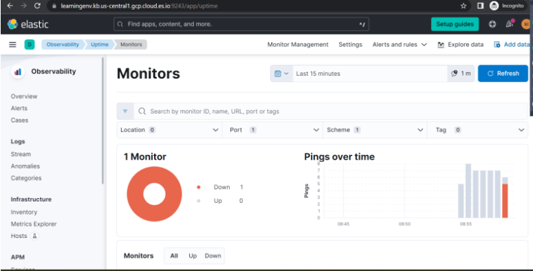

* Let's create an alert to send email about status of server

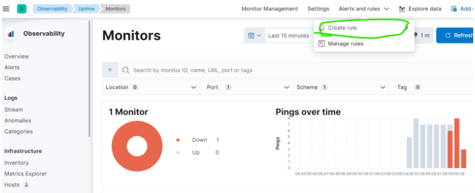
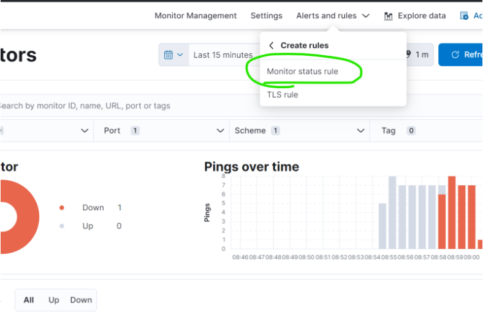

### Exercise

* Create an alert to check if the nop-app and nop-db is up or not
* Create a linux vm install apache/nginx.
* Also create uptime dashboard in elastic stack
    * based on icmp (ping)
    * based on http

### Basic Check list

* Create a linux vm in any  cloud and ssh into it
* Create a ssh key from cloud and importing ssh into cloud from your system
* Concept of Service/Daemon
* Package management – apt
* json and yaml files
*concept of sudo
* using vi or nano editor
*Fixing:
    * Post on Slack

### Novice Check List

* knowing the problem. log files and read the logs to figure out errors
* installation steps and configuration steps for any application
* Concept of environmental variables and setting
    * User
    * System

### Expert Check list

* Understanding system architectures
* System Design fundamentals

### Troubleshooting Beats

* All the elastic componets logs can be viewed using _**journalctl**_ `journalctl -u heartbeat-elastic.service`
* Look into yaml for syntax issues and cloud id and auth for configuration
* Ensure metrics are enabled

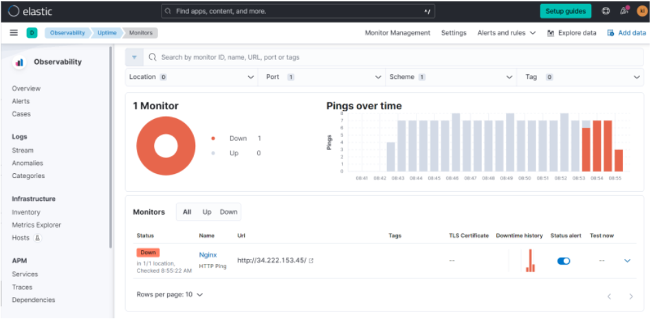
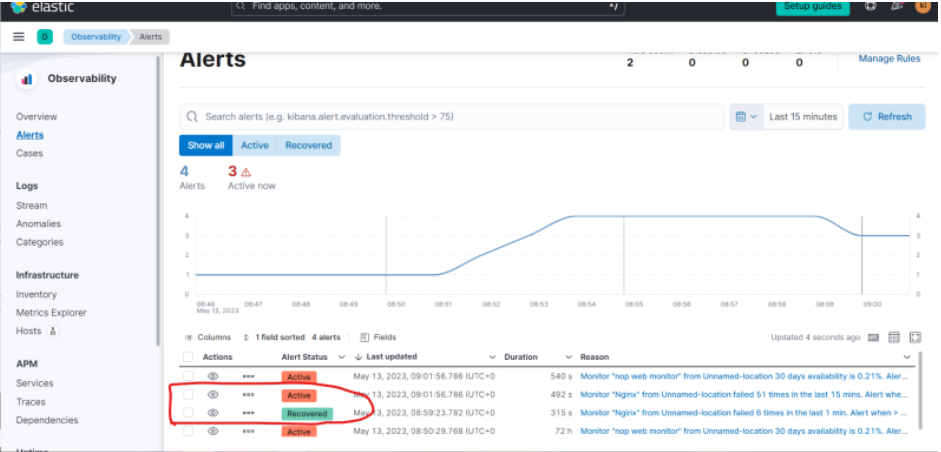

### Metric Beat

* This beat collects metrics about system and some predefined applications
* Install metric beat 

    [ Refer Here : https://www.elastic.co/guide/en/beats/metricbeat/8.7/setup-repositories.html#_apt ]

* We will get system and nginx metrics to elastic cloud in next session

### Metric Beats to Capture Metrics

* Enable nginx metrics
    * navigate to /etc/metricbeat/modules.d and rename nginx.yml.disabled to nginx.yml
    * copy the dashboards into bin `sudo cp -r /usr/share/metricbeat/kibana/ /usr/share/metricbeat/bin`
* Now start the metric beat after setting in metricbeat.yml
    * cloud.id
    * cloud.auth
    * kibana url
* We have configured all dashboards
    * System Overview :

    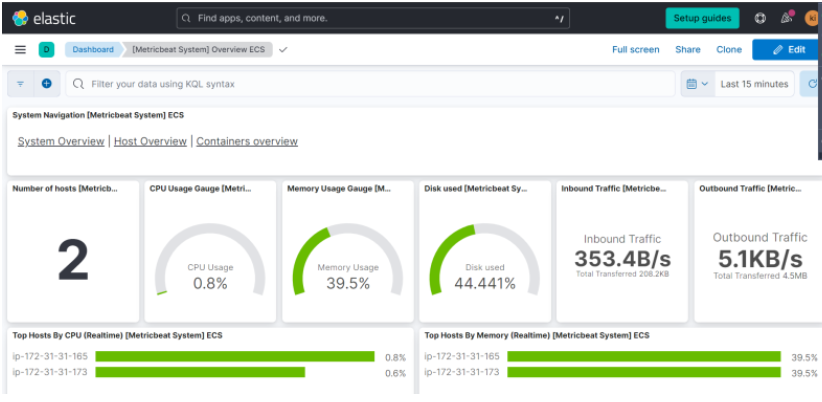

    * Apache Dashboard

    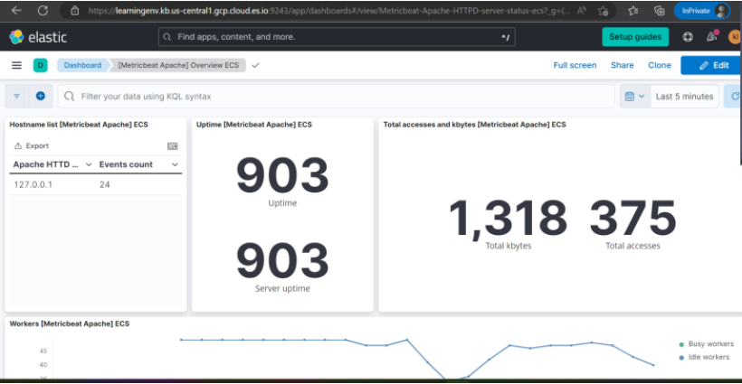

### Log Analysis


* Every logging mechanism will have levels, most widely adopted levels are
    * _**INFO**_ : This is informational log
    * _**DEBUG**_ : This is informative log
    * _**ERROR**_ : This represents errors
    * _**CRITICAL/FATAL**_ : This represents serious system failures

* Logs are time based information.
* In Elastic Stack we have logstash which can extract the logs, transform and load into elastic search for querying/visualizations
* Logstash does the transformations with the help of plugins
    * _**input plugins**_ : to read from different sources,for input plugins supported by logstash

    [ Refer Here : https://www.elastic.co/guide/en/logstash/current/input-plugins.html ]

    * _**filter plugins**_ : to transform the log,for filter plugins

    [ Refer Here : https://www.elastic.co/guide/en/logstash/current/filter-plugins.html ]

    * _**output plugins**_ : to store the output to different sources, for output plugins

    [ Refer Here : https://www.elastic.co/guide/en/logstash/current/output-plugins.html ]

* Installing logstash :

    [ Refer Here : https://www.elastic.co/guide/en/logstash/current/installing-logstash.html#_apt ]

* Ideal use case for us

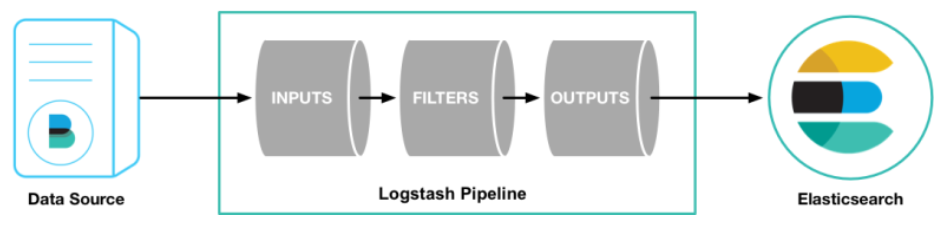

### Logstash

* Let's create a linux vm and explore logstash

### Logstash pipeline

* Logstash pipeline syntax
```
input {}
filter {}
output {}
```
* In input section we can define the datasources from where we process inputs `Extract`
* In Filter section we define the transformations `Transform`
* In output section we define the destination `Load`
* The list of inputs is all the installed logstash input plugins and same with other sections

### Let's create a very basic pipeline which reads input from stdin and displays out to stdout

* Stdin input plugin Refer Here
* Stdout output plugin Refer Here
* Pipeline
```
input {
    stdin {
    }
}
output {
    stdout {
    }
}
```
* Create a file with above content in `/tmp/first.conf`
cd in `/usr/share/logstash` and execute the following command `sudo ./bin/logstash -f /tmp/first.conf`

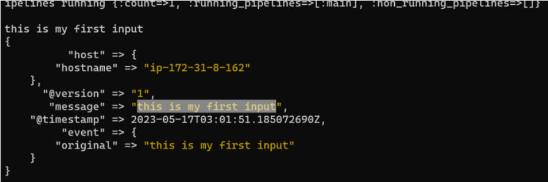

* Now let's the codec from rubydebug to json
Edit first.conf with following content and start logstash `sudo ./bin/logstash -f /tmp/first.conf`
```
input {
    stdin {
    }
}
output {
    stdout {
        codec => json
    }
}
```
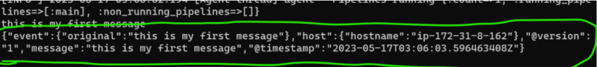

* Let's add one more output to some file `stdout => codec => rubydebug
* For file output plugin

    [ Refer Here : https://www.elastic.co/guide/en/logstash/current/plugins-outputs-file.html ]

```
input {
    stdin {
    }
}
output {
    stdout {
    }
    file {
        path => "/tmp/output%{+YYYY-MM-dd}.txt"
    }
}
```
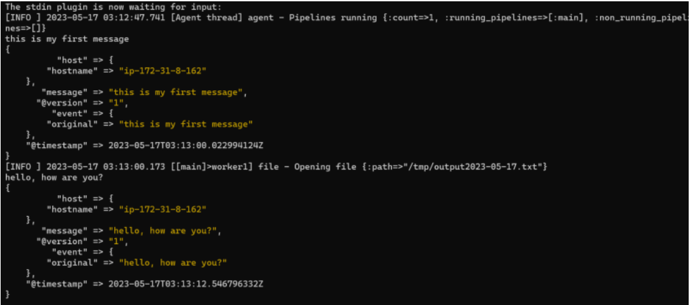

* Open the file for contents

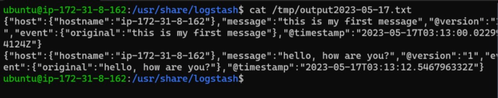

### Activity 2 : Let's create a pipeline to read the file /tmp/test and display the contents in stdout

* input = file
* output = stdout
```
input {
    file {
        path => ["/tmp/test"]
    }
}
output {
    stdout {

    }
}
```
* install apache and redirect `/var/log/apache2/access.log` to stdout
```
input {
    file {
        path => ["/var/log/apache2/access.log"]
    }
}
output {
    stdout {

    }
}
```
* Let's try to understand filters.
* Grok filter can parse unstructured data into fields 

    [ Refer Here : https://www.elastic.co/guide/en/logstash/current/plugins-filters-grok.html ]

### Grok Patterns

* Open the DevTools in Kibana and then Grok Debugger

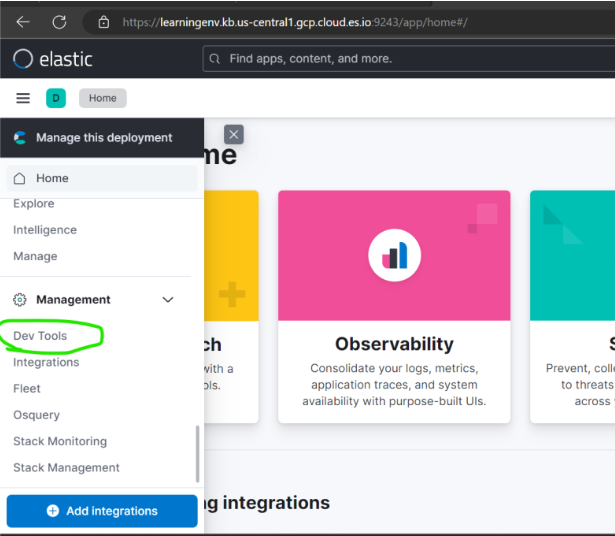
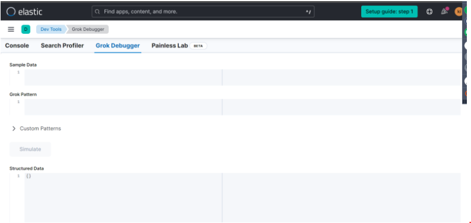

* For the grok filter in logstash

    [ Refer Here : https://www.elastic.co/guide/en/logstash/current/plugins-filters-grok.html ]

* For writing your own patterns use regex 
    [ Refer Here : https://developer.mozilla.org/en-US/docs/Web/JavaScript/Guide/Regular_expressions/Cheatsheet ]

* Let's try to build a simple pattern as shown below

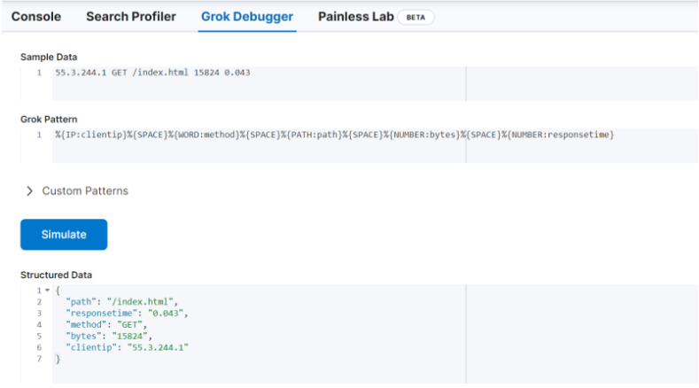
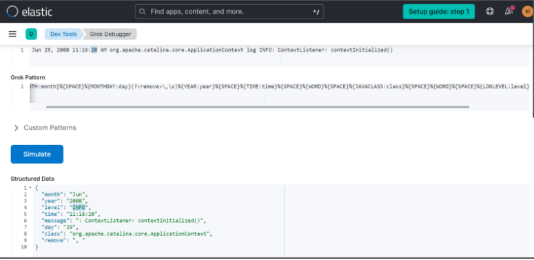
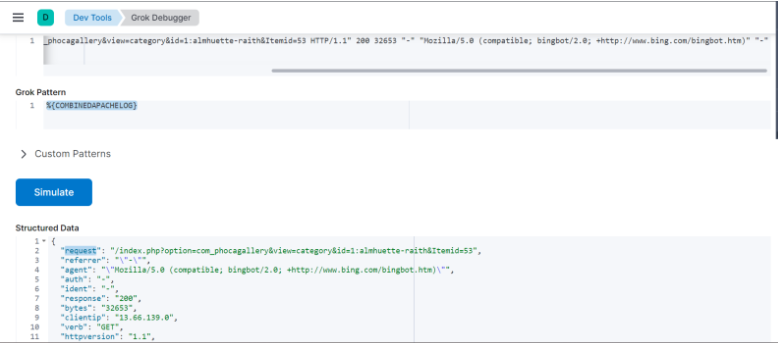
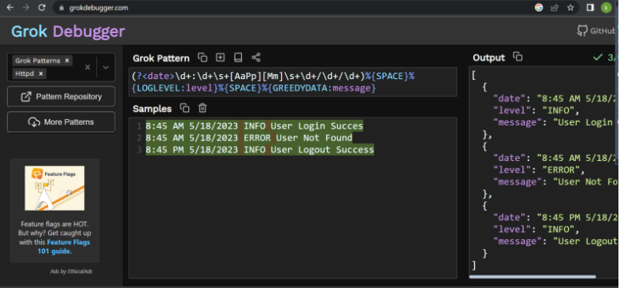
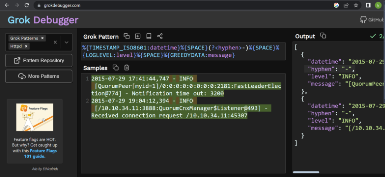

* For grok debugger

    [ Refer Here : https://grokdebugger.com/ ]

###


